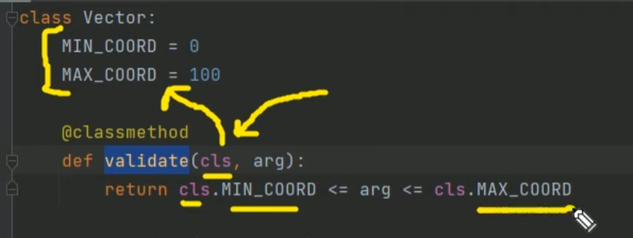

# OOP_Python

## Lesson 1 and 2  >>>
    1 - Attributes Class and Object 
    2 - methods [__doc__] and [__dict__]
    3 - getattr, hasattr, setattr, delattr

## Lesson 3 and 4 >>>
    1 - Magic Methods 
    2 - Initializer and Finalizer

## Lesson 5 and 6 >>>
    1 - @calssmethod - method класса

    2 - @staticmethod - Статический метод

# FUN MOD

